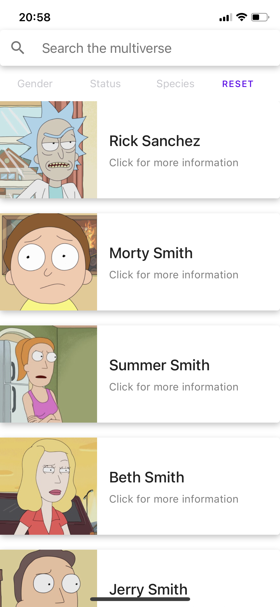
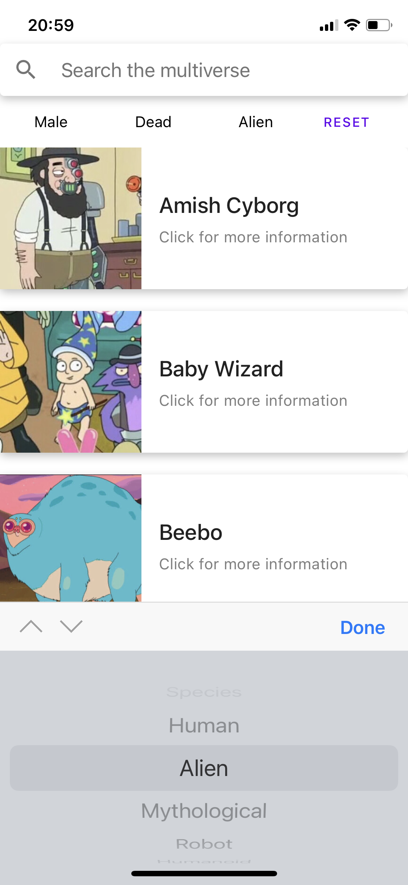
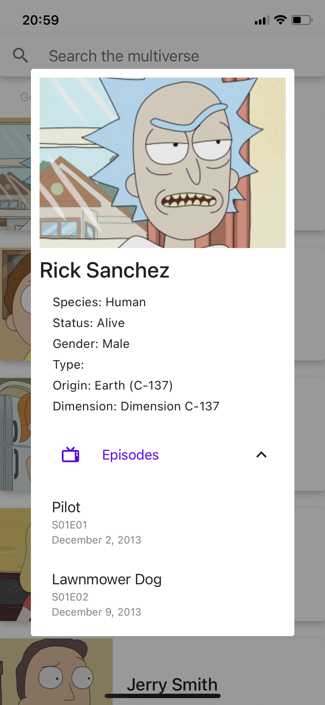
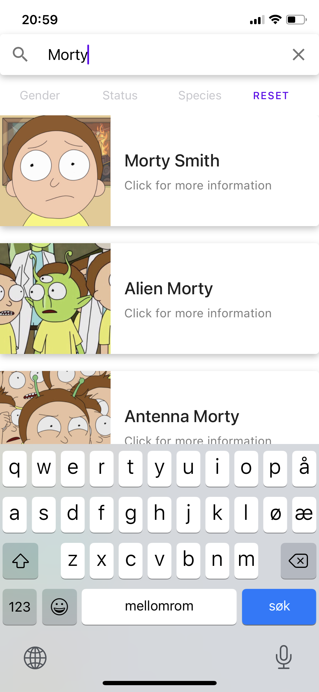

Rick and Morty Database app

## Kjøre prosjektet

Kan lastes ned på android [her](https://play.google.com/store/apps/details?id=com.fredrikbw.nativeapp)

Eller kjøres lokalt:

* Klon eller last ned prosjektet

Åpne en terminal og naviger til  *rickandmory-db/nativeapp*

For å installere kjører du 
    
    npm install

og (om du ikke har Expo CLI fra før av)

    npm install --global expo-cli

For å starte prosjektet kjører du:

    expo start

Bentytt [expo-client](https://expo.io/) på mobilen, scan deretter QR-koden som vises i nettleseren eller benytt iOS / Andorid emulator for å teste ut appen.

## Om applikasjonen

Vi har lagd en app som baserer seg på data fra [The Rick and Morty API](https://rickandmortyapi.com/) . Der man har mulighet til å søke blant alle karakterene i tegneserien Rick and Morty.

## Teknologi
Prosjektet er bygget i React Native og er implementert i Typescript.
Vi har brukt Expo for å initialisere prosjektet.

For UI komponenter har vi benyttet kjernekomponentene i React Native samt biblotekene [React Native Elements](https://reactnativeelements.com/) og [React Native Paper](https://callstack.github.io/react-native-paper/index.html). For å velge mellom de ulike filtrene har vi benyttet Picker komponenten [react-native-picker-select](https://www.npmjs.com/package/react-native-picker-select)

I klienten har vi benyttet oss av [Appollo Client](https://www.apollographql.com/docs/react/). Apollo lar oss hente og cache data fra API'et. I **App.tsx** instansieres et Apollo Client objekt med uri til API'et. Ved å bruke ApolloProvider har hele applikasjonen tilgang til API'et. Dett lar oss enkelt skrive graphQL queries i de ulike komponentene. Ved å bruke apollo sin cache blir også siden mer effektiv. Dette kan man merke ved å vise inn mer detaljer om samme karakter flere ganger, da dataen kun trenger å lastes inn første gang.

## Innhold og funksjonalitet
Appen er designet for å gi brukeren en visuell fremstilling av resultatlisten ved hjelp av bilder. Hvert element i resultatlisten har altså et bilde av karakteren som hovedfokus, hvor man kan trykke seg inn på elementet i resultatlisten for å få mer informasjon om karakteren. 

### Søkegrensesnitt
Søk gjøres via et søkefelt, der man søker blant navnet på alle karakterene i API'et. Appen søker hver gang du endrer noe i søkefeltet, det samme gjelder når du bytter hva slags filter som gjelder. 

### Resultatsett
Resultatsettet lastes dynamisk ved scrolling. Vi har benyttet oss av [FlatList](https://reactnative.dev/docs/flatlist) for å vise resultatet. Det lastes inn 20 objekter om gangen. Ved å bruke FlatList's onEndReached prop laster vi inn 20 nye obketer, og legger de til resultatsettet når man scroller til bunnen av siden. Hvert item i FlatListen er representert med et egent komponent **ListItem.tsx**. 

### Detaljert visning
For hvert søkeresultat kan man trykke på resultaet, og med det få opp en detaljert visning. Her får man mer informasjon om hver karakter, og man kan også se en liste over alle episodene som denne karakteren har hvert med i. Denne informasjonen blir hentet basert på ID'en til karakteren man trykker på. Ved å kun hente denne dataen når man viser mer detaljer slipper vi å laste inn like mye data i FlatListen. 

### Raffinere søkeresultatet
For å raffinere søkeresultatet kan man filtrere på gender, status (alive, dead, unknown) og species. Alle søke og filtreringsparameterene kan tilbakestilles med en reset-knapp. 
